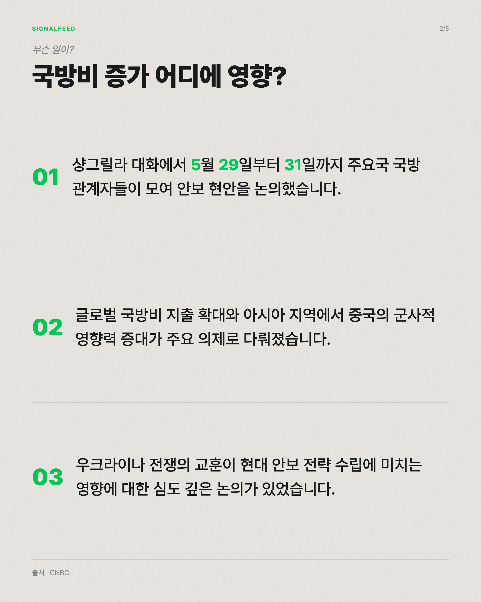
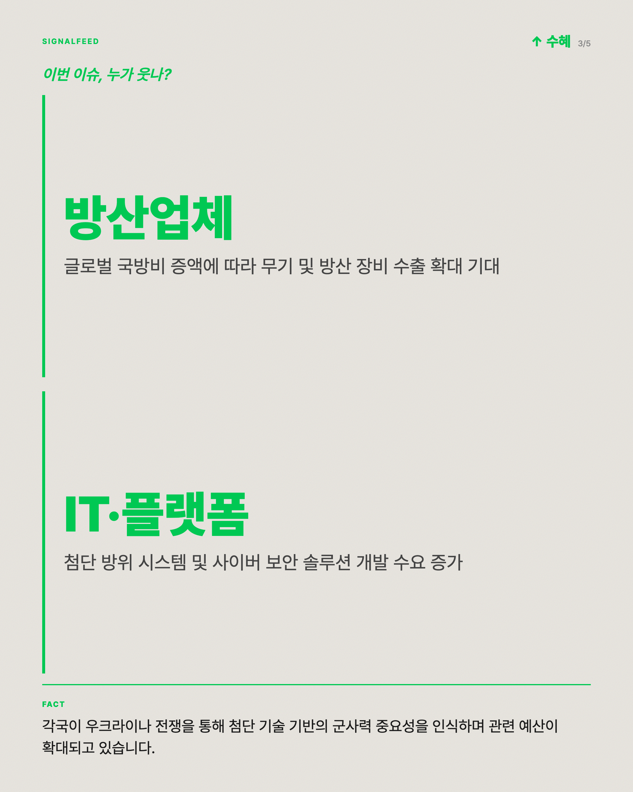
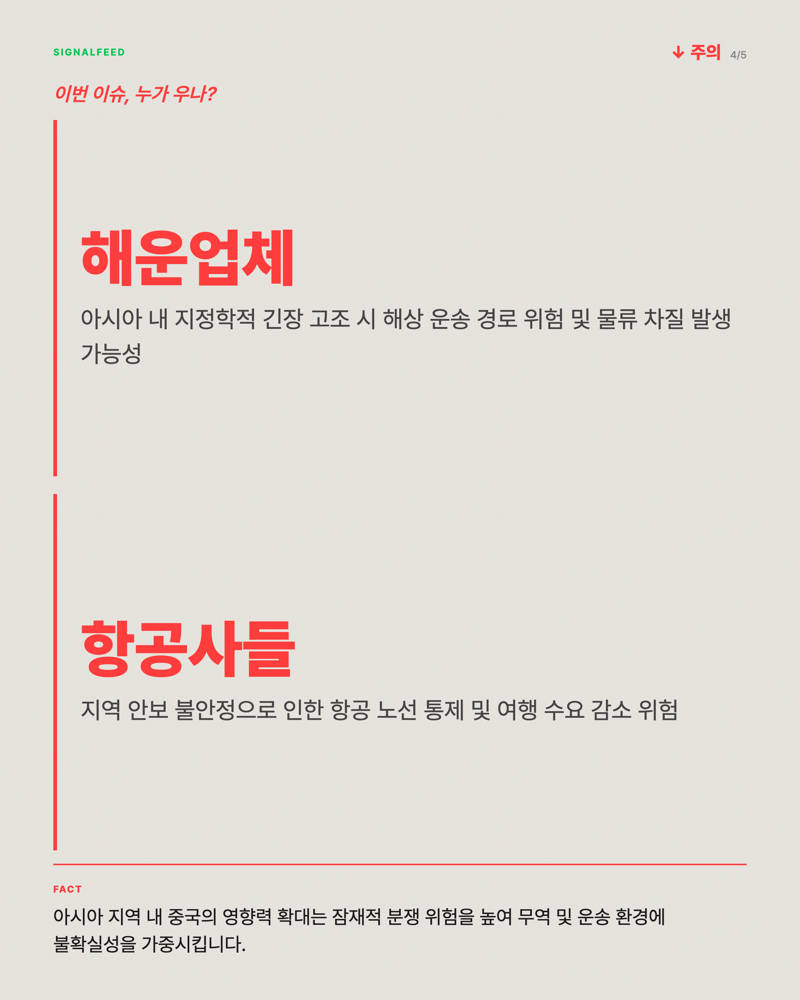
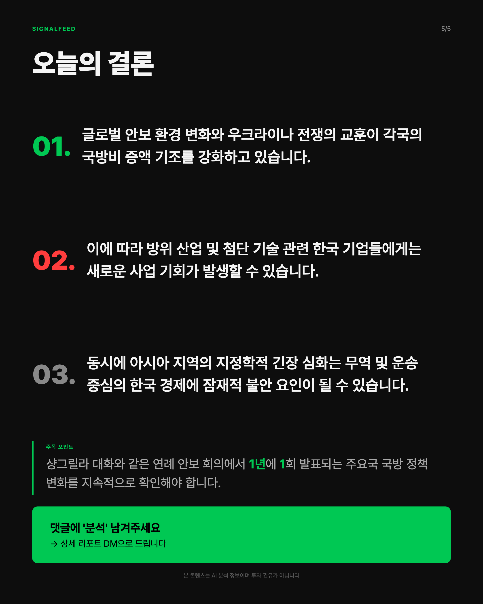

# SignalFeed

글로벌 매크로 경제 뉴스를 분석해 한국 증시 영향(섹터 단위)을 추론하고,
Instagram 카드뉴스를 자동 생성하는 AI 콘텐츠 파이프라인입니다.

## Pipeline
RSS/Finnhub 수집 → UMAP+HDBSCAN 클러스터링 → Gemini 2.5 Flash 구조화 생성
→ 코드 레벨 검증 → Playwright 렌더링 (1080x1350 카드뉴스 5장)

## 기술적 특징

- **무료 API만으로 구성** — Gemini free tier, Pixabay, Finnhub free tier.
  유료 서비스 없이 매일 자동으로 도는 프로덕션 파이프라인 설계
- **LLM 출력을 신뢰하지 않는 아키텍처** — 섹터-근거 정합성, 콘텐츠 중복,
  예측/권유 표현을 전부 코드 레벨 validator로 강제 검증. 검증 실패 시
  자동 교정 또는 안전한 fallback으로 전환
- **구조적 안전장치** — Pydantic enum으로 티커/회사명 노출을 스키마
  레벨에서 원천 차단 (프롬프트 지시가 아닌 타입 시스템으로 강제)
- **비용 관리** — LLM 응답 캐싱으로 반복 렌더링 시 API 호출 0회,
  일일 쿼터 20 req 내에서 운영
- **레퍼런스 학습 시스템** — 벤치마크 콘텐츠(인스타/유튜브)를 자동
  수집·분석해 디자인·훅 패턴을 축적, 생성 프롬프트에 반영

## Tech Stack
Python · Google Gemini API · scikit-learn / UMAP / HDBSCAN ·
Playwright · Pydantic · yfinance

## 개발 방식

Claude Code를 페어 프로그래밍 파트너로 사용. 아키텍처 결정과 버그
원인 진단은 직접 주도, 구현은 Claude Code와 반복적으로 진행.

- 예: "바이오·제약" 섹터에 "보험 수익률" 근거가 붙는 버그를 발견 →
  원인은 프롬프트 지시만으로 막던 검증을 코드 레벨 validator로 전환
- 세션별 의사결정 기록: [CLAUDE.md](./CLAUDE.md) ·
  [docs/session_archive.md](./docs/session_archive.md)

## Sample Output
카드뉴스 5장 구조 (커버 → 팩트 → 수혜 섹터 → 주의 섹터 → 결론)

|  |  |  |
|---|---|---|
|  |  | |

---
개인 프로젝트 · 진행 중
